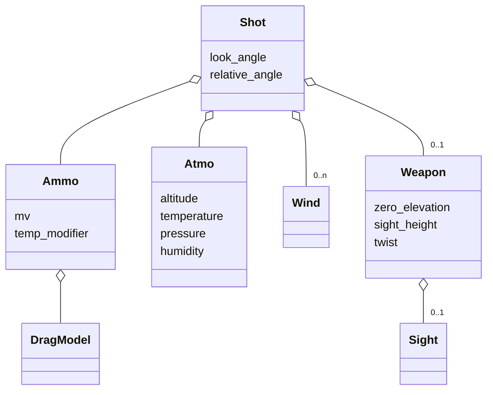

# Overview

This page summarizes the primary classes for this project and how they fit together at runtime.

## Core Workflow

- [`Calculator`][pyballistic.interface.Calculator]: High-level entry point to compute trajectories. Accepts a [`Shot`][pyballistic.shot.Shot] (scene) and returns a [`HitResult`][pyballistic.trajectory_data.HitResult] with trajectory rows and helpers.
- [`Shot`][pyballistic.shot.Shot]: Details a shooting scenario – [`Ammo`][pyballistic.munition.Ammo], [`Atmo`][pyballistic.conditions.Atmo], [`Weapon`][pyballistic.munition.Weapon], [`Wind`][pyballistic.conditions.Wind], and angles (look/slant, relative, cant).
- [`HitResult`][pyballistic.trajectory_data.HitResult]: Wrapper for accessing and displaying calculated results, including a list of [`TrajectoryData`][pyballistic.trajectory_data.TrajectoryData] (which are detailed characteristics of points on the ballistic trajectory).

## Projectile & Environment

The classes that comprise a [`Shot`][pyballistic.shot.Shot]:

- [`Ammo`][pyballistic.munition.Ammo]: Wraps muzzle velocity, including optional powder temperature sensitivity, together with a DragModel.
    - [`DragModel`][pyballistic.drag_model]: Physical details of a projectile, including aerodynamic drag as a function of velocity.  (Drag is typically modelled via Ballistic Coefficient and standard [drag tables][pyballistic.drag_tables] – G1, G7, etc.)
- [`Atmo`][pyballistic.conditions.Atmo]: Standard or custom atmosphere.
- [`Wind`][pyballistic.conditions.Wind]: Piecewise-constant winds by distance.
- [`Weapon`][pyballistic.munition.Weapon]: Gun specifications (sight height, rifle twist rate, zero elevation, [`Sight`][pyballistic.munition.Weapon] details).

## [Engines](../concepts/engines.md)

Calculation engines implement different algorithms for integration and targeting.  All inherit from [`BaseIntegrationEngine`][pyballistic.engines.base_engine.BaseIntegrationEngine].

- [RK4IntegrationEngine][pyballistic.engines.RK4IntegrationEngine]
- [EulerIntegrationEngine][pyballistic.engines.EulerIntegrationEngine]
- [VelocityVerletIntegrationEngine][pyballistic.engines.VelocityVerletIntegrationEngine]
- [SciPyIntegrationEngine][pyballistic.engines.SciPyIntegrationEngine]

???+ api "Selected API references"

	[`pyballistic.interface.Calculator`][pyballistic.interface.Calculator] 
	[`pyballistic.shot.Shot`][pyballistic.shot.Shot] 
	[`pyballistic.munition.Ammo`][pyballistic.munition.Ammo] 
	[`pyballistic.conditions.Atmo`][pyballistic.conditions.Atmo] 
	[`pyballistic.munition.Weapon`][pyballistic.munition.Weapon] 
	[`pyballistic.trajectory_data.HitResult`][pyballistic.trajectory_data.HitResult] 
	[`pyballistic.trajectory_data.TrajectoryData`][pyballistic.trajectory_data.TrajectoryData] 

