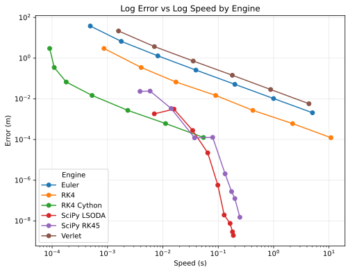
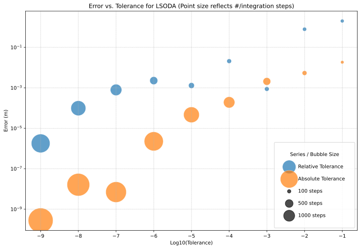

# Summary of Ballistic Engine Benchmarks

This document summarizes the findings from the [`examples/BenchmarkEngines.ipynb`][BenchmarkEngines.ipynb] notebook, which compares the performance and accuracy of the different calculation engines available in the `pyballistic` library.

## Introduction

The core of any ballistics calculator is a numerical integration engine (an ODE solver) that computes the trajectory of a projectile under the forces of gravity and air resistance. The choice of engine and its configuration represents a trade-off between precision and compute speed. This benchmark was created to explore these trade-offs and guide the selection of an appropriate engine for different use cases.

The engines covered here:

1. **Euler** (`euler_engine`): The most elementary, first-order integration method.  
2. **RK4** (`rk4_engine`): Runge-Kutta fourth-order integration.  
3. **Verlet** (`verlet_engine`): Velocity-Verlet, which is a second-order symplectic method.
4. **Cython RK4** (`cythonized_rk4_engine`): Same as the RK4 engine, but implemented in Cython which is a variant of Python that compiles (instead of interpreting) for maximum compute speed.
5. **SciPy** (`scipy_engine`): The [SciPy](https://scipy.org) library contains the most sophisticated numerical methods with compiled backends.

## Key Concepts

* A ballistic trajectory consists of the position and velocity of a projectile as a function of time.
* All these numerical integrators approximate the trajectory by computing incremental time steps from the launch point of the projectile (at $t=0$).
  * The smaller the time step, the less error in the approximation.
  * The higher the *order* of the method the more quickly error is reduced as step size is decreased.

## Methodology

To provide a fair comparison, a standardized testing methodology was established:

1.  **Reference Trajectory**: A highly accurate "ground truth" trajectory is computed using the `scipy_engine` with the `LSODA` method, configured with extremely low error tolerances (`1e-12`). This serves as the baseline against which all other calculations are measured.

2.  **Test Scenario**: The trajectory of a common long-range rifle shot is computed out to 2km for all tests:
    *   **Ammunition**: A 7.62mm, 10-gram bullet (G7 BC of 0.22).
    *   **Muzzle Velocity**: 800 m/s.
    *   **Shot Angle**: A high elevation (60 mils) to achieve a range of approximately 2 kilometers.
    *   **Atmosphere**: ICAO Standard Atmosphere.

3.  **Error Calculation**: The error for any given engine is defined as the vertical miss distance (in meters) at the exact horizontal range where the reference trajectory returns to zero elevation (just over 1,861m).

4.  **Benchmarking**: Each engine is run multiple times across a range of configurations (step size, or *error tolerance* in the case of SciPy). For each run, we measure:
    *   **Error (m)**: As defined above.
    *   **Integration Steps**: The number of steps the solver took to compute the trajectory.
    *   **Speed (s)**: The average time taken to compute the trajectory, measured using `%timeit`.

## Summary Results

1.  **Highest Precision: `scipy_engine`**. The adaptive SciPy engine can deliver the most accurate results, and do so with an order of magnitude less compute than the (pure) Python engines.
2.  **Highest Speed: `cythonized_rk4_engine`.** The compiled RK4 engine is an order of magnitude faster than the SciPy engine.  It can't achieve the same micron-level precision when pushed to its limit, but it easily delivers results with error measured in millimeters at a distance of 2km, which is more than adequate for practical purposes.

This chart shows the range of performance and speed observed for each engine.  Smaller values are better.  For each engine we can see that if we give it more calculation time we get results with smaller error.

## Notes

### Python Engines

These engines are implemented from scratch in pure Python, and make it easy to see and understand exactly how the calculator works.  Their integration step size can be adjusted with the [`cStepMultiplier`][pyballistic.engines.base_engine.BaseEngineConfigDict] configuration parameter.

* **`rk4_engine`:**  The RK4 algorithm is the most frequently used for ballistic calculators, and we continue to recommend it.  This is the default `pyballistic` engine.
* **`euler_engine`:**  Euler's method is the most simple integration algorithm, which will be recognizable to any calculus student.  However, it is a first-order method with well known limitations and therefore recommended only for study.
* **`verlet_engine`**: The velocity Verlet algorithm is a second-order integrator with the distinctive property of being _symplectic_, which makes it an excellent choice for modelling physical systems that should conserve energy.  It excels in a vacuum scenario ([`examples/BenchmarkVacuumTraj.ipynb`][BenchmarkVacuumTraj.ipynb]), but otherwise its performance is similar to the simpler Euler method: A ballistic trajectory with air resistance is a _dissipative system_ because energy is lost to drag. The Verlet method's strengths are in non-dissipative, time-reversible systems.

### SciPy Engine

The `scipy_engine` employs the state-of-the-art numerical methods provided by the SciPy library.

*   **Integration Methods**: It supports a variety of methods. Among those recommended for this purpose are `LSODA`, `RK45`, `DOP853`, and `BDF`. We have found `LSODA` and `RK45` to be most effective in our testing, so those are the ones analyzed here.
*   **Adaptive Step Size**: These solvers use adaptive step sizes, dynamically adjusting their internal timestep to meet the user-specified `absolute_tolerance` and `relative_tolerance`.
*   **Performance**: The SciPy solvers are in a class of their own. They achieve the highest accuracy with the fewest integration steps, demonstrating a superior accuracy-to-speed ratio. As the tolerance is tightened, the error decreases exponentially until it hits the limits of floating-point precision.

SciPy is something of a black box: one cannot be certain exactly how it will proceed given a particular method and error tolerance.  Some illustrations of unexpected behavior can be found in our vacuum scenario study [`examples/BenchmarkVacuumTraj.ipynb`][BenchmarkVacuumTraj.ipynb].  However, we confirm that smaller error tolerance limits result in more iterations and smaller errors, as shown in the following chart summarizing tests on this scenario:

[BenchmarkEngines.ipynb]:
https://github.com/dbookstaber/pyballistic/blob/master/examples/BenchmarkEngines.ipynb

[BenchmarkVacuumTraj.ipynb]:
https://github.com/dbookstaber/pyballistic/blob/master/examples/BenchmarkVacuumTraj.ipynb