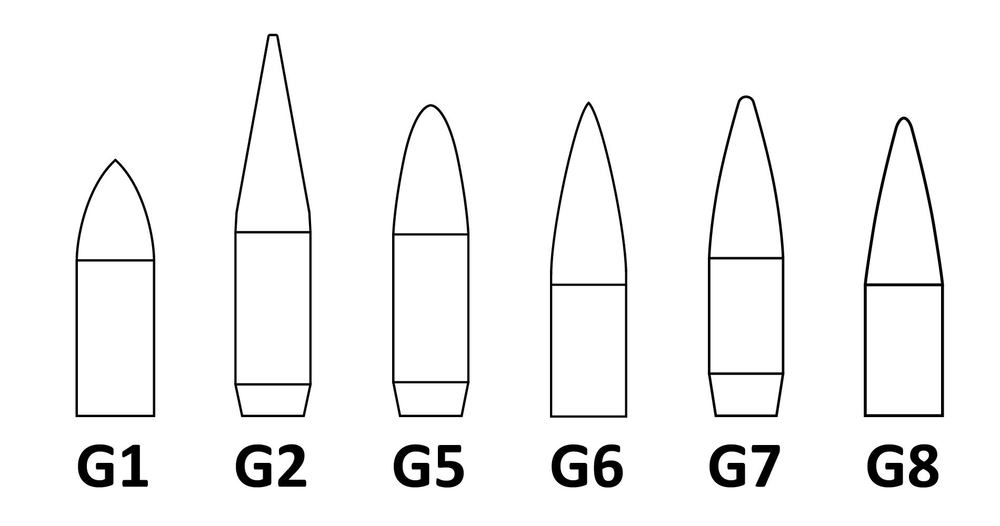

## Drag Models

???+ api "API Documentation"

    [`pyballistic.drag_model`][pyballistic.drag_model] 

The drag subsystem models aerodynamic resistance via Ballistic Coefficients that reference standard drag tables (G1, G7, etc.), or custom Mach–$C_d$ pairs.

- [`DragModel`][pyballistic.drag_model.DragModel]: Single-BC scaling of a reference drag table; optional weight/diameter/length for spin-drift calculations.
- [`BCPoint`][pyballistic.drag_model.BCPoint] + [`DragModelMultiBC(...)`][pyballistic.drag_model.DragModelMultiBC]: Interpolate BC across velocity/Mach to better match measured data.
- Helpers: [`make_data_points`][pyballistic.drag_model.make_data_points], [`sectional_density`][pyballistic.drag_model.sectional_density], [`linear_interpolation`][pyballistic.drag_model.linear_interpolation].

Use with `Ammo(dm=DragModel(...))` to parameterize the projectile.

## Standard Models

???+ api "API Documentation"

    [`pyballistic.drag_tables`][pyballistic.drag_tables] 

### Standard Tables
* [`TableG1`][pyballistic.drag_tables.TableG1]: Flat-base bullet (most common sporting ammunition)
* [`TableG7`][pyballistic.drag_tables.TableG7]: Boat-tail, spitzer (long-range match bullets)
* [`TableG2`][pyballistic.drag_tables.TableG2]: Conical, banded, boat-tail artillery projectile
* [`TableG5`][pyballistic.drag_tables.TableG5]: Round-nose, boat-tail
* [`TableG6`][pyballistic.drag_tables.TableG6]: Flat-base, spire-point
* [`TableG8`][pyballistic.drag_tables.TableG8]: Flat-base, 10 caliber secant ogive
* [`TableGI`][pyballistic.drag_tables.TableGI]: Ingalls G1
* [`TableGS`][pyballistic.drag_tables.TableGS]: 9/16" smooth sphere
* [`TableRA4`][pyballistic.drag_tables.TableRA4]: .22LR 40gr

----

### Standard Projectile Profiles

----

### Standard Drag Curves

