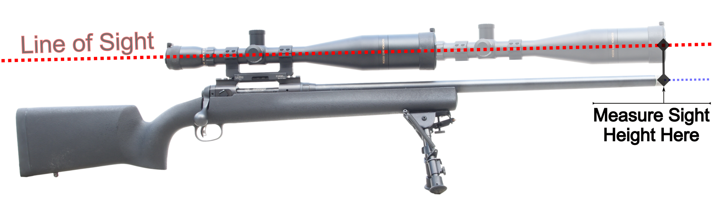

??? api "API Documentation"

    [`pyballistic.munition.Weapon`][pyballistic.munition.Weapon]

A `Weapon` instance is a mutable object that describes all details of a gun that can affect a trajectory.

## Weapon properties

* [`sight_height`][pyballistic.munition.Weapon.sight_height]: Sight height, which is the distance between the line of sight and barrel center at the muzzle, measured perpendicular to the line of sight as shown in the following figure:

* [`sight`][pyballistic.munition.Sight]: Sight details for converting adjustments into click values.

* [`twist`][pyballistic.munition.Weapon.twist]: Twist rate of barrel rifling, in terms of length to complete 1 rotation.  Positive values indicate right-hand twist, negative values indicate left-hand twist.

* [`zero_elevation`][pyballistic.munition.Weapon.zero_elevation]: Angle of barrel centerline relative to line of sight when the sight is set to "zero." 

## Example

Imports:
```python
from pyballistic import Weapon, Unit, Sight
```

Then create a Weapon instance:
```python
weapon = Weapon(
    sight_height=Unit.Inch(2.),
    twist=Unit.Inch(10.),
    zero_elevation=Unit.Mil(0),
    sight=Sight(
        'FFP', 2,
        h_click_size=Unit.Mil(0.2),
        v_click_size=Unit.Mil(0.2)
    )
)
```
In this example, we use calls to [Unit][pyballistic.unit.Unit] to initialize [Weapon][pyballistic.munition.Weapon] fields with specific unit types.
We also can do it using `float` values, in which case those attributes will be initialized with unit types defined by [`PreferredUnits`][pyballistic.unit.PreferredUnits] class.
